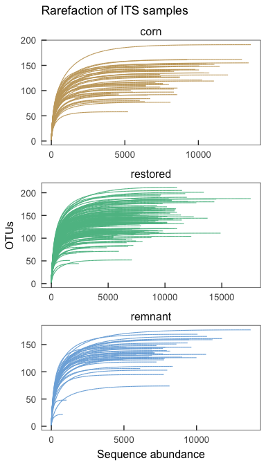
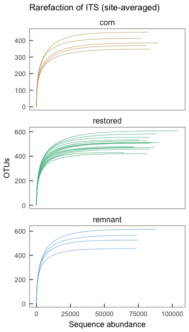
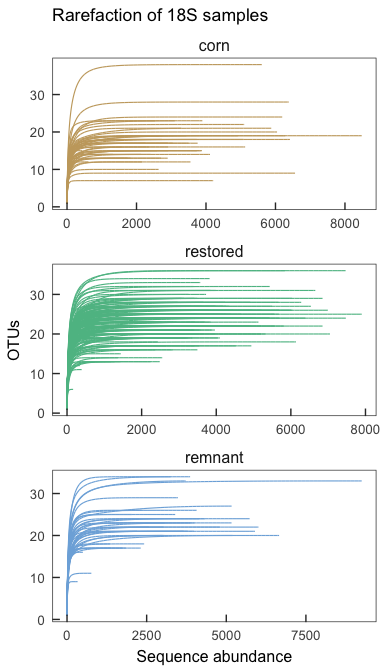
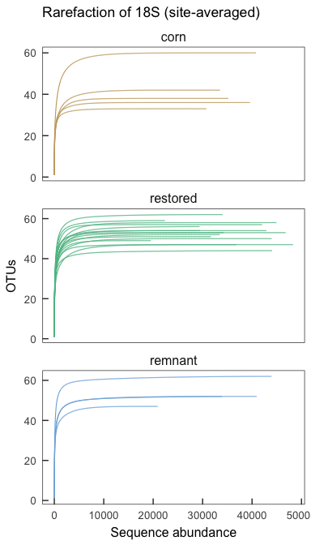
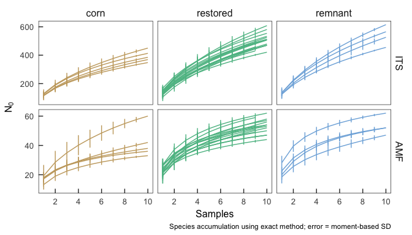

Species Data: ETL and Diagnostics
================
Beau Larkin

Last updated: 13 May, 2025

- [Description](#description)
  - [Styles](#styles)
- [Functions](#functions)
  - [Root path function](#root-path-function)
  - [ETL: clean OTU data and return formatted
    objects](#etl-clean-otu-data-and-return-formatted-objects)
  - [Species accumulation](#species-accumulation)
  - [Confidence interval helper](#confidence-interval-helper)
- [Load and process data](#load-and-process-data)
  - [Import data](#import-data)
  - [ETL processing](#etl-processing)
  - [UNIFRAC tables for AMF](#unifrac-tables-for-amf)
- [Sampling depth and coverage](#sampling-depth-and-coverage)
  - [Rarefaction: ITS site-averaged](#rarefaction-its-site-averaged)
  - [Rarefaction: AMF sample](#rarefaction-amf-sample)
  - [Rarefaction: AMF site-averaged](#rarefaction-amf-site-averaged)
- [Species accumulation curves](#species-accumulation-curves)

# Description

- Load and clean QIIME2 sequence data
- Apply fungal traits
- Create sample and site OTU tables
- Export UNIFRAC tables for AMF
- Evaluate sampling effort with rarefaction and accumulation \#
  Resources \## Packages

``` r
packages_needed <- c("tidyverse", "vegan", "knitr", "colorspace", "plotrix", "rprojroot", "rlang")
if (any(!packages_needed %in% rownames(installed.packages())))
    install.packages(packages_needed[!packages_needed %in% rownames(installed.packages())])
invisible(lapply(packages_needed, library, character.only = TRUE))
```

## Styles

``` r
source(root_path("resources", "styles.R"))
```

# Functions

## Root path function

``` r
root_path <- function(...) rprojroot::find_rstudio_root_file(...)
```

## ETL: clean OTU data and return formatted objects

``` r
etl <- function(spe, env = sites, taxa, traits = NULL, varname, gene, cluster_type = "otu",
                colname_prefix, folder) {
    varname <- enquo(varname)
    data <- spe %>% left_join(taxa, by = join_by(`#OTU ID`))
    
    meta <- if (gene == "ITS") {
        data %>%
            mutate(!!varname := paste0(cluster_type, "_", row_number())) %>%
            select(!starts_with(gene)) %>%
            rename(otu_ID = `#OTU ID`) %>%
            select(!!varname, everything()) %>%
            separate_wider_delim(taxonomy, delim = ";",
                                 names = c("kingdom", "phylum", "class", "order", "family", "genus", "species"),
                                 too_few = "align_start") %>%
            mutate(across(kingdom:species, ~ str_sub(.x, 4))) %>%
            left_join(traits, by = join_by(phylum, class, order, family, genus)) %>%
            select(-kingdom, -Confidence)
    } else {
        data %>%
            mutate(!!varname := paste0(cluster_type, "_", row_number())) %>%
            select(!starts_with(gene)) %>%
            rename(otu_ID = `#OTU ID`) %>%
            select(!!varname, everything()) %>%
            separate(taxonomy,
                     into = c("class", "order", "family", "genus", "taxon", "accession"),
                     sep = ";", fill = "right") %>%
            select(-Confidence)
    }
    
    spe_samps <- data %>%
        mutate(!!varname := paste0(cluster_type, "_", row_number())) %>%
        select(!!varname, starts_with(gene)) %>%
        column_to_rownames(var = as_name(varname)) %>%
        t() %>% as.data.frame() %>% rownames_to_column("rowname") %>%
        mutate(rowname = str_remove(rowname, colname_prefix)) %>%
        separate_wider_delim("rowname", delim = "_", names = c("field_key", "sample")) %>%
        mutate(across(c(field_key, sample), as.numeric)) %>%
        left_join(env %>% select(field_key, field_name), by = join_by(field_key)) %>%
        select(field_name, sample, everything(), -field_key) %>%
        arrange(field_name, sample)
    
    spe_avg <- spe_samps %>%
        group_by(field_name) %>%
        summarize(across(starts_with(cluster_type), mean), .groups = "drop") %>%
        arrange(field_name)
    
    samples_fields <- spe_samps %>%
        count(field_name, name = "n") %>%
        left_join(sites, by = join_by(field_name)) %>%
        select(field_name, region, n) %>%
        arrange(n, field_name) %>%
        kable(format = "pandoc", caption = paste("Number of samples per field", gene, sep = ",\n"))
    
    write_csv(meta, root_path(folder, paste("spe", gene, "metadata.csv", sep = "_")))
    write_csv(spe_samps, root_path(folder, paste("spe", gene, "samples.csv", sep = "_")))
    write_csv(spe_avg, root_path(folder, paste("spe", gene, "avg.csv", sep = "_")))
    
    list(samples_fields = samples_fields, spe_meta = meta, spe_samps = spe_samps, spe_avg = spe_avg)
}
```

## Species accumulation

``` r
spe_accum <- function(data) {
    df <- data.frame(
        samples = specaccum(data[, -c(1, 2)], method = "exact")$site,
        richness = specaccum(data[, -c(1, 2)], method = "exact")$richness,
        sd = specaccum(data[, -c(1, 2)], method = "exact")$sd
    )
    df
}
```

## Confidence interval helper

``` r
ci <- function(x) std.error(x) * qnorm(0.975)
```

# Load and process data

## Import data

``` r
its_otu <- read_delim(root_path("otu_tables/ITS/ITS_otu_raw.txt"), show_col_types = FALSE)
its_taxa <- read_delim(root_path("otu_tables/ITS/ITS_otu_taxonomy.txt"), show_col_types = FALSE)
amf_otu <- read_delim(root_path("otu_tables/18S/18S_otu_raw.txt"), show_col_types = FALSE) %>% select(-last_col())
amf_taxa <- read_delim(root_path("otu_tables/18S/18S_otu_taxonomy.txt"), show_col_types = FALSE)
traits <- read_csv(root_path("otu_tables/2023-02-23_fungal_traits.csv"), show_col_types = FALSE) %>%
    select(phylum:primary_lifestyle)
```

``` r
sites <- read_csv(root_path("clean_data/sites.csv"), show_col_types = FALSE) %>%
    mutate(field_type = factor(field_type, ordered = TRUE, levels = c("corn", "restored", "remnant"))) %>%
    select(-lat, -long, -yr_restore)
```

## ETL processing

``` r
its <- etl(spe = its_otu, taxa = its_taxa, traits = traits, varname = "otu_num", gene = "ITS",
           colname_prefix = "ITS_TGP_", folder = "clean_data")
```

``` r
amf <- etl(spe = amf_otu, taxa = amf_taxa, varname = "otu_num", gene = "18S",
           colname_prefix = "18S_TGP_", folder = "clean_data")
```

## UNIFRAC tables for AMF

``` r
amf$spe_samps %>%
    mutate(field_sample = paste(field_name, sample, sep = "_")) %>%
    select(field_sample, everything(), -field_name, -sample) %>%
    column_to_rownames("field_sample") %>%
    t() %>% as.data.frame() %>% rownames_to_column("otu_num") %>%
    left_join(amf$spe_meta %>% select(otu_num, otu_ID), by = "otu_num") %>%
    select(otu_ID, everything(), -otu_num) %>%
    write_tsv(root_path("otu_tables/18S/18S_samps_4unifrac.tsv"))
```

``` r
amf$spe_avg %>%
    column_to_rownames("field_name") %>%
    t() %>% as.data.frame() %>% rownames_to_column("otu_num") %>%
    left_join(amf$spe_meta %>% select(otu_num, otu_ID), by = "otu_num") %>%
    select(otu_ID, everything(), -otu_num) %>%
    write_tsv(root_path("otu_tables/18S/18S_avg_4unifrac.tsv"))
```

# Sampling depth and coverage

Script running `rarecurve()` is commented out because it takes so long
to execute. Data were saved to the wd and are used for making figures.
These files are too large to upload to GitHub and are ignored. Please
run these calls to `rarecurve()` to create your own rarefaction and
species accumulation data files. \## Rarefaction: ITS sample

``` r
# its_rc <- rarecurve(
#     its$spe_samps %>%
#         mutate(field_sample = paste(field_name, sample, sep = "_")) %>%
#         column_to_rownames("field_sample") %>%
#         select(-field_name, -sample),
#     step = 1, tidy = TRUE)
# write_csv(its_rc, root_path("clean_data", "its_rare_samp.csv"))

its_rc <- read_csv(root_path("clean_data", "its_rare_samp.csv"), show_col_types = FALSE)
```

``` r
its_rc %>%
    separate_wider_delim(Site, delim = "_", names = c("field_name", "sample_key"), cols_remove = FALSE) %>% 
    rename(seq_abund = Sample, otus = Species, field_sample = Site) %>%
    left_join(sites, by = "field_name") %>%
    ggplot(aes(x = seq_abund, y = otus, group = field_sample)) +
    facet_wrap(vars(field_type), ncol = 1, scales = "free") +
    geom_line(aes(color = field_type), linewidth = 0.4) +
    scale_color_discrete_sequential(palette = "fieldtypes", rev = FALSE) +
    labs(x = "Sequence abundance", y = "OTUs", title = "Rarefaction of ITS samples") +
    theme_corf +
    theme(legend.position = "none")
```

<!-- -->

## Rarefaction: ITS site-averaged

``` r
# its_rc_site <- rarecurve(
#     its$spe_samps %>%
#         group_by(field_name) %>%
#         summarize(across(starts_with("otu"), sum), .groups = "drop") %>%
#         column_to_rownames("field_name"),
#     step = 1, tidy = TRUE)
# write_csv(its_rc_site, root_path("clean_data", "its_rare_site.csv"))

its_rc_site <- read_csv(root_path("clean_data", "its_rare_site.csv"), show_col_types = FALSE)
```

``` r
its_rc_site %>%
    rename(seq_abund = Sample, otus = Species, field_name = Site) %>%
    left_join(sites, by = "field_name") %>%
    ggplot(aes(x = seq_abund, y = otus, group = field_name)) +
    facet_wrap(vars(field_type), ncol = 1, scales = "free_y") +
    geom_line(aes(color = field_type), linewidth = 0.4) +
    scale_color_discrete_sequential(palette = "fieldtypes", rev = FALSE) +
    labs(x = "Sequence abundance", y = "OTUs", title = "Rarefaction of ITS (site-averaged)") +
    theme_corf +
    theme(legend.position = "none")
```

<!-- -->

## Rarefaction: AMF sample

``` r
# amf_rc <- rarecurve(
#     amf$spe_samps %>%
#         mutate(field_sample = paste(field_name, sample, sep = "_")) %>%
#         column_to_rownames("field_sample") %>%
#         select(-field_name, -sample),
#     step = 1, tidy = TRUE)
# write_csv(amf_rc, root_path("clean_data", "amf_rare_samp.csv"))

amf_rc <- read_csv(root_path("clean_data", "amf_rare_samp.csv"), show_col_types = FALSE)
```

``` r
amf_rc %>%
    separate_wider_delim(Site, delim = "_", names = c("field_name", "sample_key"), cols_remove = FALSE) %>% 
    rename(seq_abund = Sample, otus = Species, field_sample = Site) %>%
    left_join(sites, by = "field_name") %>%
    ggplot(aes(x = seq_abund, y = otus, group = field_sample)) +
    facet_wrap(vars(field_type), ncol = 1, scales = "free") +
    geom_line(aes(color = field_type), linewidth = 0.4) +
    scale_color_discrete_sequential(palette = "fieldtypes", rev = FALSE) +
    labs(x = "Sequence abundance", y = "OTUs", title = "Rarefaction of 18S samples") +
    theme_corf +
    theme(legend.position = "none")
```

<!-- -->

## Rarefaction: AMF site-averaged

``` r
# amf_rc_site <- rarecurve(
#     amf$spe_samps %>%
#         group_by(field_name) %>%
#         summarize(across(starts_with("otu"), sum), .groups = "drop") %>%
#         column_to_rownames("field_name"),
#     step = 1, tidy = TRUE)
# write_csv(amf_rc_site, root_path("clean_data", "amf_rare_site.csv"))

amf_rc_site <- read_csv(root_path("clean_data", "amf_rare_site.csv"), show_col_types = FALSE)
```

``` r
amf_rc_site %>%
    rename(seq_abund = Sample, otus = Species, field_name = Site) %>%
    left_join(sites, by = "field_name") %>%
    ggplot(aes(x = seq_abund, y = otus, group = field_name)) +
    facet_wrap(vars(field_type), ncol = 1, scales = "free_y") +
    geom_line(aes(color = field_type), linewidth = 0.4) +
    scale_color_discrete_sequential(palette = "fieldtypes", rev = FALSE) +
    labs(x = "Sequence abundance", y = "OTUs", title = "Rarefaction of 18S (site-averaged)") +
    theme_corf +
    theme(legend.position = "none")
```

<!-- -->

# Species accumulation curves

``` r
accum <- bind_rows(
    list(
        ITS = bind_rows(split(its$spe_samps, ~ field_name) %>% map(spe_accum), .id = "field_name"),
        AMF = bind_rows(split(amf$spe_samps, ~ field_name) %>% map(spe_accum), .id = "field_name")
    ),
    .id = "dataset"
) %>%
    mutate(dataset = factor(dataset, levels = c("ITS", "AMF"), ordered = TRUE)) %>%
    left_join(sites, by = "field_name")
```

``` r
ggplot(accum, aes(x = samples, y = richness, group = field_name)) +
    facet_wrap(vars(dataset), scales = "free_y") +
    geom_line(aes(color = field_type)) +
    geom_segment(aes(xend = samples, y = richness - sd, yend = richness + sd, color = field_type)) +
    scale_color_discrete_sequential(palette = "fieldtypes", rev = FALSE) +
    labs(
        x = "Samples",
        y = expression(N[0]),
        caption = "Species accumulation using exact method; error = moment-based SD"
    ) +
    scale_x_continuous(breaks = c(0, 2, 4, 6, 8, 10)) +
    theme_corf +
    theme(legend.position = "none")
```

<!-- -->
